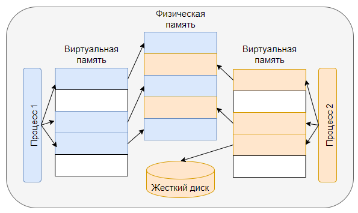

# Работа программы с виртуальной памятью

Разберём, что происходит при запуске программы и как работает виртуальная память шаг за шагом.

---

## 1. Запуск программы
- **Программа загружается с диска в память:**
  - Операционная система создаёт **виртуальное адресное пространство (ВАП)** для программы.
  - ВАП состоит из виртуальных страниц фиксированного размера (например, 4 КБ).
- Виртуальные страницы делятся на:
  - Код программы (инструкции).
  - Глобальные и статические данные.
  - Динамическую память (кучу).
  - Стек.
- Физическая память на этом этапе используется только для необходимых компонентов программы:
  - Точка входа программы.
  - Глобальные переменные.
  - Начальная структура стека.

---

## 2. Создание таблицы страниц
- Операционная система создаёт **таблицу страниц**, которая сопоставляет виртуальные адреса физическим:
  - Если виртуальная страница связана с физической, указывается её физический адрес.
  - Если виртуальная страница не связана:
    - Она ещё не инициализирована.
    - Или данные выгружены в файл подкачки.

---

## 3. Обращение к виртуальным страницам
- При выполнении программы процессор работает с виртуальными адресами.
- **Таблица страниц преобразует виртуальные адреса в физические:**
  1. Процессор запрашивает данные по виртуальному адресу.
  2. Таблица страниц проверяет:
     - Если виртуальная страница связана с физической, процессор получает данные из ОЗУ.
     - Если нет, возникает **ошибка страницы**.

---

## 4. Обработка ошибки страницы
- Если страница отсутствует в ОЗУ:
  1. **MMU (блок управления памятью)** сообщает об ошибке страницы операционной системе.
  2. Операционная система определяет, как обработать запрос:
     - Если страница ещё не использовалась:
       - ОС выделяет новую физическую страницу.
       - Обновляет таблицу страниц.
     - Если страница выгружена в файл подкачки:
       - ОС загружает её с диска в ОЗУ.
       - Обновляет таблицу страниц.
  3. После обновления процессор продолжает выполнение программы.

---

## 5. Управление памятью
- Если в ОЗУ не хватает страниц:
  - ОС использует **алгоритмы вытеснения** (например, LRU) для освобождения памяти:
    - Изменённые страницы записываются на диск (в файл подкачки).
    - Неизменённые страницы помечаются как свободные.
- Если программа снова обращается к выгруженной странице:
  - Процессор вызывает ОС, и страница загружается обратно в память.

---

## Таблица страниц: структура
- Таблица страниц хранится в оперативной памяти и состоит из записей, которые отображают виртуальные адреса на физические.
- **Иерархия таблицы страниц:**
  - **32-битные процессоры:** двухуровневая таблица.
  - **64-битные процессоры:** четырёхуровневая таблица.

Пример иерархии:
1. **Директория страниц:** Указывает на таблицу страниц.
2. **Таблица страниц:** Содержит адреса физических страниц или статус страницы.

---

## Итоговый процесс
1. Программа получает виртуальное адресное пространство.
2. Таблица страниц отображает виртуальные адреса на физические.
3. При обращении к данным или инструкциям:
   - Если данные есть в ОЗУ, они используются.
   - Если данных нет, ОС подгружает их в память.
4. ОС динамически управляет физической памятью, выгружая ненужные страницы и загружая новые.

---

Этот механизм позволяет:
- Использовать больше памяти, чем доступно физически.
- Обеспечивать изоляцию процессов.
- Эффективно управлять доступом к ресурсам.

